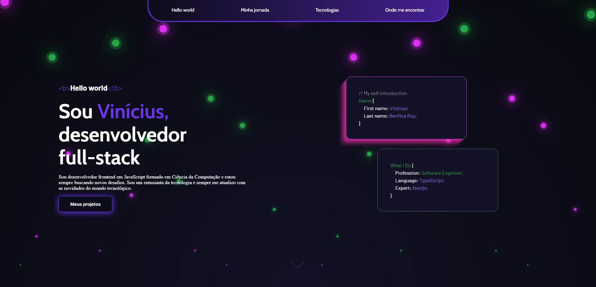
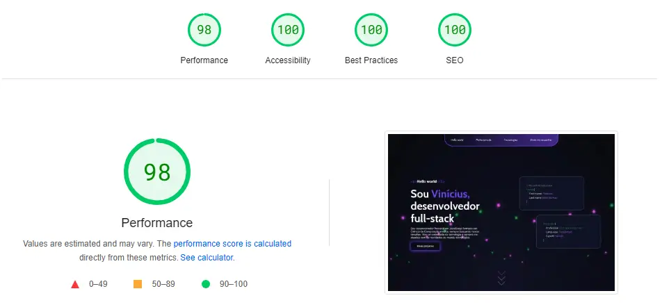

<h1 align="center">Portfólio - Vinicius Benfica</h1>

<h4 align="center"><a href="https://viniciusbenfica.com.br/">https://viniciusbenfica.com.br/</a></h4>

## 📚 Seções

O site é composto por quatro seções:

- **Início:** Nele temos uma breve apresentação;
- **Minha jornada:** Nessa seção tem uma breve descrição sobre minhas experiências profissionais;
- **Tecnologias:** Abordo sobre algumas tecnologias onde tenho mais experiência;
- **Onde me encontrar:** Disponibilizo um link com algumas das minhas redes sociais;

---

## Tecnologias utilizadas

Para o desenvolvimento deste site utilizei as seguintes tecnologias:

- HTML;
- CSS;
- JavaScript;

---

  

